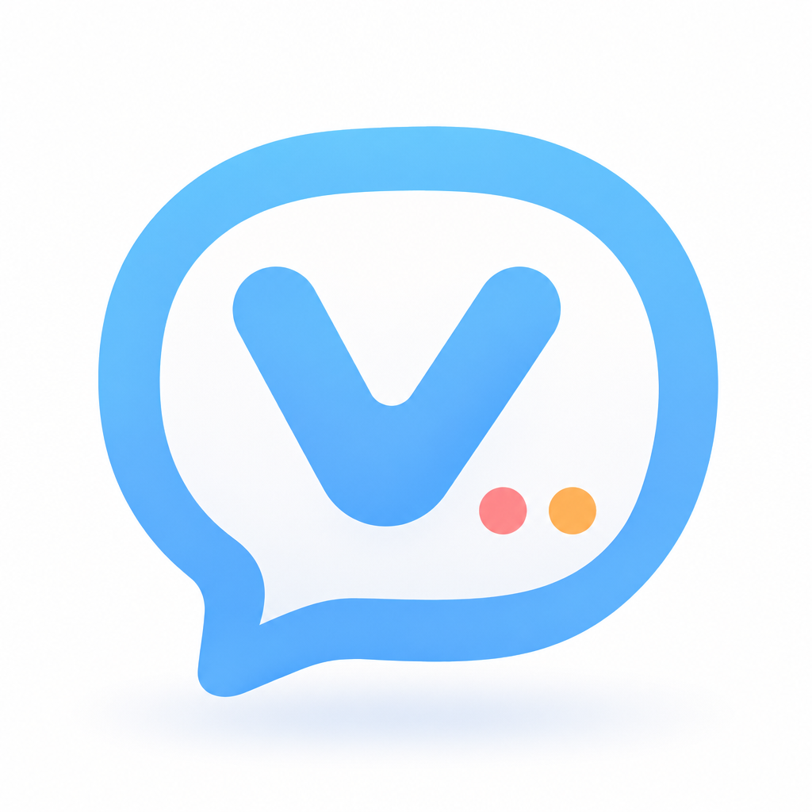

<div align="center">
  
  <h1>VRCMC</h1>
  <p><strong>Send translated messages to VRChat with ease.</strong></p>
  <p>
    
    
    
    <a href="LICENSE"></a>
  </p>
</div>

<div align="center">
  <a href="README.md">简体中文</a> ·
  <a href="README.zh-TW.md">繁體中文</a> ·
  <strong>English</strong> ·
  <a href="README.ja.md">日本語</a>
</div>

VRCMC is a VRChat Chatbox companion built with Kotlin Multiplatform and Compose Multiplatform. It connects to VRChat over OSC on your local network and can translate messages before sending them, making it useful for multilingual conversations, voice input, and real-time communication.

> [!NOTE]
> VRCMC is an independent open-source project and is not affiliated with VRChat Inc. VRChat is a trademark of its respective owner.

## Highlights

- **OSC Chatbox**: Send text to VRChat while respecting the Chatbox limit of 144 characters and 9 lines.
- **Multiple devices**: Save multiple IP and port configurations, and scan for devices on the same local network.
- **Multiple translation services**: Supports OpenAI-compatible, Anthropic, DeepL, Google Web, Microsoft Edge Web, MyMemory, LibreTranslate, and other protocols and services.
- **Bilingual output**: Select one or two target languages and customize the display order of the original text and translations.
- **Resilient requests**: Configure timeouts, automatic retries, fallback models, custom headers, and streaming responses.
- **Interpretation modes**: Use voice input from your system keyboard and send content based on the VRChat microphone state.
- **Local experience**: Chat history, device configurations, and error logs are stored locally, with light, dark, and multilingual UI support.

## Translation Services

VRCMC includes configurations for OpenAI, Anthropic / Claude, xAI / Grok, DeepSeek, Gemini, Qwen, GLM, Kimi, DeepL, Microsoft Edge Web, Ollama, LibreTranslate, and more. Custom OpenAI-compatible and Anthropic-compatible endpoints are also supported.

Some public translation APIs do not require an API key. Their availability, rate limits, and privacy policies are controlled by the corresponding providers. When you use a third-party translation service, the text to be translated is sent to your selected provider. Review its terms as appropriate.

Microsoft Edge Web uses an undocumented Edge browser endpoint, not the supported Azure AI Translator API. It may be rate-limited, changed, or discontinued without notice.

## Data and Security

- Device information, chat history, application settings, and error logs are stored locally by default.
- API keys and custom authentication headers are stored separately from regular settings.
- Sensitive configuration is protected with Android Keystore on Android, DPAPI on Windows, and Keychain on iOS.
- The current macOS and Linux desktop versions do not persist sensitive data such as API keys.
- Android application backup is disabled to reduce the risk of configuration data being exported through system backups.

## Project Structure

```text
VRCMC/
├── composeApp/
│   └── src/
│       ├── commonMain/   # Shared UI, state, translation, and OSC interfaces
│       ├── androidMain/  # Android platform implementation
│       ├── desktopMain/  # JVM desktop platform implementation
│       ├── iosMain/      # iOS platform implementation
│       └── commonTest/   # Shared logic tests
├── gradle/               # Gradle Wrapper and version catalog
├── image/                # Project image assets
└── LICENSE
```

## Contributing

Issues and pull requests are welcome. Before submitting changes, keep platform implementations consistent where possible and run the tests relevant to your changes. Changes involving OSC, translation requests, or configuration storage should ideally include shared logic tests.

## License

This project is licensed under the [MIT License](LICENSE).
